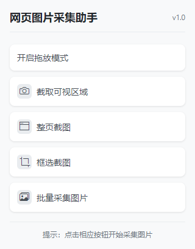
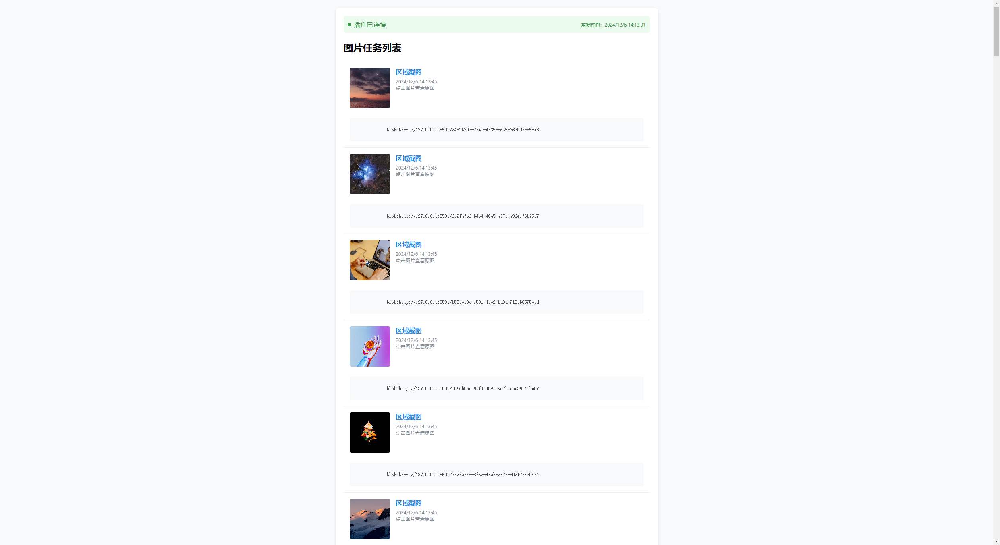

# 网页图片采集助手

一个强大的 Chrome 插件，用于网页图片采集、截图和处理, 并包含了实用 SDK 程序，你可以更方便的将收集的结果回传到你的网站。

# 免责声明

本插件仅作为技术工具，为用户提供内容采集和分析功能。请注意：

1. 资源归属

- 通过本插件采集的所有图片、文本等资源的版权归原作者/网站所有
- 插件开发者与这些采集的资源内容无关，不对其负有任何责任
- 用户使用本插件采集的任何内容与插件作者无关

2. 使用责任

- 用户应当遵守相关法律法规和原网站的使用条款
- 用户对使用本插件采集的内容承担全部责任
- 请勿将本插件用于任何非法或侵权行为

3. 版权声明

- 用户在使用采集的内容时，应当遵守原内容的版权规定
- 建议在使用采集内容时注明来源
- 如涉及商业用途，请事先获得原作者/网站授权

本插件仅提供技术支持，不对用户的具体使用行为及其后果承担责任。如有任何疑问，请联系原内容的版权所有者。

## 1. 插件功能

### 主要功能

- 🖼️ 网页图片采集
- 📸 区域截图
- 📱 可视区域截图
- 🖥️ 全页面截图
- 💾 一键保存

### 使用方法

1. **安装插件**

   ```bash
   # 1. 克隆仓库
   git clone [repository-url]

   # 2. 在 Chrome 中加载插件
   - 打开 Chrome 扩展管理页面 (chrome://extensions/)
   - 启用"开发者模式"
   - 点击"加载已解压的扩展程序"
   - 选择项目文件夹[plugin]
   ```

2. **使用插件**

   - 点击插件图标打开功能面板
   - 选择需要的功能：
     - 拖放模式：直接拖拽网页图片
     - 截图模式：框选区域截图
     - 全页面截图：捕获整个页面
     - 批量采集图片：批量采集整个页面的可用图片
   - 右键网页图片可以直接采集

3. **修改环境变量**

   - plugin\env.js

   ```javascript
   // 共享的配置
   const Config = {
     TARGET_ORIGIN: "http://127.0.0.1:5500/example/index.html",
   };
   ```



## 2. 示例页面

### 功能展示

- 实时预览采集的图片
  

### 使用方法

1. 打开 `example\index.html` live server 进行测试
2. 示例页面会自动连接到插件
3. 可以实时查看采集结果

## 3. ChromeImageHunterSDK

### 功能特点

- 提供标准化的接口
- 支持 TypeScript
- 模块化设计
- 完整的类型定义
- 支持 base64 和 TypedArray 两种图片数据格式
- 自动处理消息通信

### 安装使用

```bash
cd sdk
pnpm install
pnpm run build
```

### API 示例

```typescript
import ChromeImageHunterSDK from "../sdk/dist/index.js";

const sdk = new ChromeImageHunterSDK({
  onConnect: () => {
    console.log("插件已连接");
  },
  onDisconnect: () => {
    console.log("插件已断开");
  },
  onImage: ({ blob, message }) => {
    // blob: 图片的 Blob 对象
    // message: 包含图片来源、时间戳等完整消息
    console.log("收到图片:", blob);
    console.log("图片信息:", message);

    // 使用示例：
    const imageUrl = URL.createObjectURL(blob);
    const img = document.createElement("img");
    img.src = imageUrl;
    document.body.appendChild(img);
  },
});

// 检查连接状态
console.log("是否已连接:", sdk.isConnected());

// 不再使用时销毁实例
sdk.destroy();
```

### SDK 类型定义

```typescript
// 消息接口
interface ChromeImageHunterSDKMessage {
  type: "FROM_EXTENSION" | "FROM_CONTENT";
  action: string;
  timestamp: number;
  sourceUrl: string;
  targetOrigin: string;
  taskType: string;
  base64?: string;
  typedArray?: number[];
}

// SDK 配置接口
interface ChromeImageHunterSDKOptions {
  onConnect?: () => void;
  onDisconnect?: () => void;
  onImage?: (option: {
    blob: Blob;
    message: ChromeImageHunterSDKMessage;
  }) => void;
}
```

# TODO

- [ ] 历史记录管理
- [ ] 采集图片来源信息和元数据
- [ ] 发布 ChromeImageHunterSDK
- [✔] 使用 typedArray 方案替代 base64 方案,节省体积
